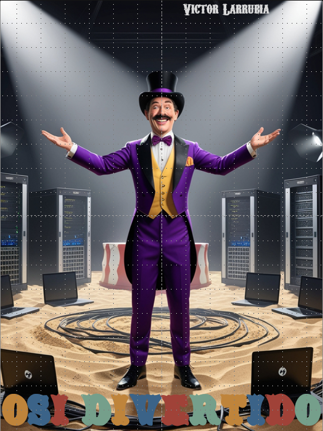

# Projeto EBOOK Gerado por I.A.s

Projeto com o objetivo de gerar um ebook digital com as facilidades das ferramentas de IA. todos os prompts
seguem abaixo.

<a href="https://github.com/felipeAguiarCode/prompts-recipe-to-create-a-ebook/blob/main/output/ebook%20-%20css%20jedi%20output.pdf" title="View PDF now"> 📕Clique aqui para ler</a>

## 💻 Tecnologias utilizadas no projeto

- [TextCortex](https://app.textcortex.com/user/signup?reference_id=Victor_BJAhb) 
- [Leonardo](https://leonardo.ai/)
- [PowerPoint](https://www.microsoft.com/en/microsoft-365/powerpoint)

## 🧠 Prompts

TextCortex：

|   Ação   | prompt                                                                                                                                                                                                                                                                         |
| :------: | ------------------------------------------------------------------------------------------------------------------------------------------------------------------------------------------------------------------------------------------------------------------------------ |
|  conteúdo superficial  | Escreva um e-book detalhado sobre as sete camadas do modelo de referência OSI (Open Systems Interconnection), incluindo exemplos específicos de dispositivos, tecnologias e protocolos associados a cada uma das seguintes camadas:

1. Camada Física
2. Camada de Enlace de Dados
3. Camada de Rede
4. Camada de Transporte
5. Camada de Sessão
6. Camada de Apresentação
7. Camada de Aplicação

O e-book deve ser redigido de forma cativante e descontraída, utilizando um estilo de escrita cômico e informal, a fim de tornar o conteúdo técnico mais acessível e agradável ao leitor.
Cada capitulo deve conter pelo menos 200 capalvras cada e se referir a uma camada, Totalizando 9 capitulos, iniciando com introdução e finalizando com conclusão.                                                        |
| conteúdo específico| Detalhe mais reescrevendo o trecho do livro abaixo usando o mesmo contexto usado a cima, utilize 700 palavras:
{CÁPITULO ESCRITO PELO PROMPT conteúdo superficial} |

Leonardo：

|  Ação  | prompt                                                                                 |
| :----: | -------------------------------------------------------------------------------------- |
| capa | Type of Image: Photorealistic Image
Subject Description: A happy and sarcastic funny cabaretier, serving as the ringmaster of a circus, dressed in a purple suit. He must have his arms open as if he were presenting an attraction. The cabaretier is positioned in the center of the ring, surrounded by server racks with big large amount of visible cables extending from the racks and across the sand floor, along with multiple visible computers and notebooks. The lighting is dark, with beams of light emanating from two spotlights ion the floor behind the cabaretier.; Art Styles: Realistic HQ; Art Inspirations: Watchman HQ; Camera: Isometric perspective (front view from slightly above); Render Related; Information: Lens: 35mm |

## ✨ Features

- Conteúdo gerado via TextCortex
- Imagens geradas via Leonardo

## 📚 Materiais

- Imagens utilizadas em `assets`
- ebook gerado durante as aulas em `output`

## 🛠️ Instruções de execução

Utilize os prompts acima nas ferramentas sugeridas para gerar o material base e utilize uma ferramenta de edição de documentos como power point, libreoffice , indesign para diagramação.

---

⌨️ com 💜 por [Felipe Aguiar](https://github.com/victorlarrubia)
